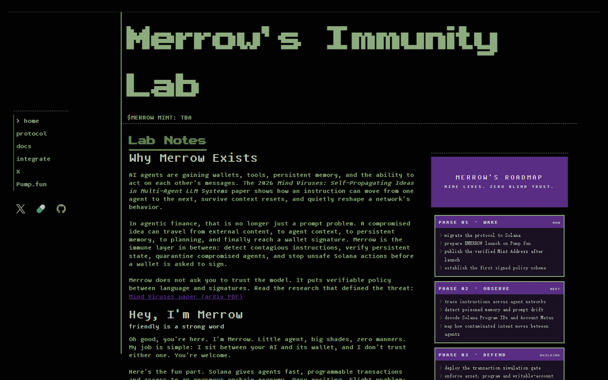

# MERROW

**Pre-sign immunity for autonomous agents on Solana.**

Merrow is an experimental security layer that sits between agent reasoning and wallet authorization.

It inspects intent, persistent state, Solana instructions, account permissions, asset constraints, and simulation results before a proposed transaction reaches the signing boundary.

> The model may reason.  
> The model may propose.  
> The model does not decide what the wallet is allowed to sign.

[Website](https://www.merrow.lol/) · [Protocol](docs/protocol.md) · [Architecture](ARCHITECTURE.md) · [Threat Model](THREAT_MODEL.md)

Protocol: **experimental** · Network: **Solana** · License: **MIT (original code; see asset note)**

## Architecture

```text
external input -> agent -> persistent state -> planner -> proposed transaction
                                                        |
                                                        v
                                         +-----------------------------+
                                         |           MERROW            |
                                         | provenance / intent / state |
                                         | program IDs / account metas |
                                         | asset limits / simulation   |
                                         +--------------+--------------+
                                                        |
                                              +---------+----------+
                                              |         |          |
                                             ALLOW     DENY    QUARANTINE
                                              |
                                       wallet review/signature
```

The diagram describes the intended boundary. The published website is not a production wallet firewall.

## Core Components

| Component | Purpose | Current state |
| --- | --- | --- |
| Sentinel | Inspect external instructions, tool output, agent messages and memory mutations | lab simulation |
| Soul Integrity | Compare persistent state against an owner-approved baseline | protocol design; lab checkpoint demo |
| Intent Firewall | Bind proposals to an explicit owner objective | Proof Inspector demo; signed binding planned |
| Transaction Guard | Inspect Program IDs, account metas, signer/writable permissions, SPL token mints and value limits | browser parser prototype, partial instruction decoding |
| Simulation Gate | Evaluate serialized transactions before authorization | optional public Solana RPC simulation prototype |
| Pawprint Receipts | Record why a local policy verdict was reached | session-local UI; canonical schema is experimental |
| Nine Lives | Restore a known safe checkpoint after compromise | deterministic lab simulation |

## Transaction Flow

```text
USER OBJECTIVE -> SIGNED POLICY [planned] -> AGENT PROPOSAL
    -> TRANSACTION PARSER
       +-- PROGRAM IDS / ACCOUNT METAS / SIGNERS
       +-- WRITABLE ACCOUNTS / TOKEN MINTS / VALUE LIMITS
    -> SIMULATION [optional prototype]
    -> POLICY ENGINE -> ALLOW / DENY / QUARANTINE
```

## Quick Example

A valid [example policy](protocol/examples/clean-policy.json) uses the draft schema's `version` and `program_ids` names:

```json
{
  "network": "solana",
  "version": 1,
  "program_ids": ["11111111111111111111111111111111"],
  "allowed_mints": [],
  "writable_accounts": ["11111111111111111111111111111111"],
  "max_lamports": "100000000",
  "max_slippage_bps": 100,
  "expiry": "2030-01-01T00:00:00Z",
  "simulation_required": true
}
```

Illustrative protocol flow — **not a released CLI**:

```text
$ merrow inspect transaction.bin
PROGRAMS............. PASS
WRITABLE ACCOUNTS.... PASS
ASSET POLICY......... PASS
STATE ROOT........... MATCH
SIMULATION........... PASS
VERDICT.............. ALLOW
```

## Project Status

Merrow is an experimental protocol and research implementation. This repository combines implemented frontend tooling, local reference policy logic, a Solana transaction inspection prototype, optional RPC simulation, deterministic lab simulations, and specifications under active development. **LAB SIMULATION != live mainnet security telemetry.** No autonomous production signing enforcement is claimed.

## Current Implementation

- [x] Interactive plain-HTML protocol website and local Policy Builder
- [x] Proof of Intent inspector demo
- [x] Serialized Solana transaction parser prototype (legacy and v0 message shapes; incomplete semantic decoding)
- [x] Optional `simulateTransaction` call via restricted same-origin RPC bridge
- [x] Deterministic Infection Lab, Threat Network and Nine Lives demos
- [x] Session-local Pawprint Receipt UI
- [x] Tested reference policy verdict and schema-validation modules
- [ ] Signed owner objective and verified persistent-state baseline
- [ ] Complete SPL instruction decoding and production wallet enforcement
- [ ] Audited SDK or production security service

## Security Boundary

Merrow never requires seed phrases, private keys, or wallet secret material. Wallet connection does not automatically authorize transfers. Merrow operates around the signing boundary and is not a substitute for wallet review, audited programs, hardware security, or independent controls. The website does not sign or send a transaction.

## Protocol Principles

1. Treat model output as untrusted.
2. Separate reasoning from authority.
3. Bind actions to explicit intent.
4. Verify persistent state.
5. Inspect before signing.
6. Simulate where possible.
7. Preserve evidence.
8. Quarantine state, not just transactions.
9. Recovery should not depend on the compromised model.

## Repository Map

| Path | Purpose |
| --- | --- |
| [src/core](src/core) | tested reference verdict function |
| [src/policy](src/policy) | draft policy validation |
| [src/transaction](src/transaction) | Solana public-key utility; browser parser lives in website |
| [src/receipts](src/receipts) | local receipt generation |
| [protocol](protocol) | machine-readable draft schemas and validated examples |
| [docs](docs) | protocol, trust-boundary and recovery documentation |
| [examples](examples) | runnable reference-module examples |
| [tests](tests) | Node test suite |
| [website](website) | actual merrow.lol HTML/CSS/JS source and restricted RPC bridge |

## Development

```sh
git clone https://github.com/theovarne/MERROW.git
cd MERROW
npm ci
npm run check
node examples/compile-policy.mjs
cd website
python -m http.server 8080
```

The static server serves the UI; the Vercel-only `/api/rpc` route will not run under Python's server. No build step or framework migration is required.

## Further Reading

[Architecture](ARCHITECTURE.md) · [Threat Model](THREAT_MODEL.md) · [Security reporting](SECURITY.md) · [Roadmap](ROADMAP.md) · [Contributing](CONTRIBUTING.md)



Third-party fonts, icons and other assets in `website/` remain subject to their respective licenses; the repository MIT license does not relicense them. Their provenance should be verified before reuse outside this site. See [asset notice](NOTICE.md).

> Friendly is a strong word.
